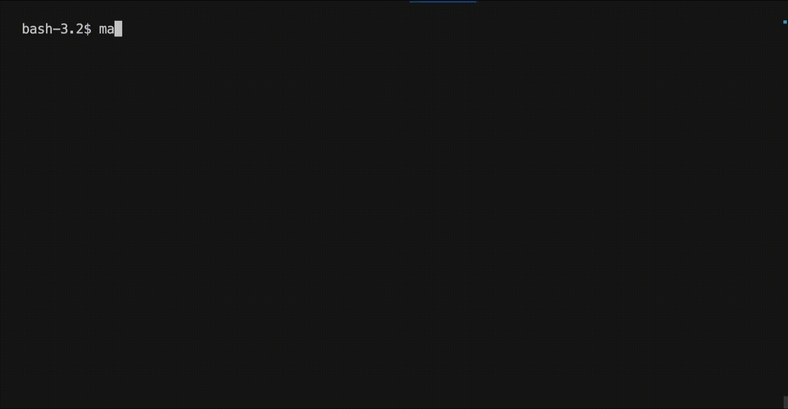

# Minishell
### As beautiful as a shell



## Overview
Minishell is a project designed to create a simple, custom shell in C, closely mimicking the functionality of Bash. The project focuses on understanding processes, file descriptors, and various shell operations. This README provides a detailed guide on the structure, functionality, and usage of the Minishell project.

## Table of Contents
1. [Introduction](#introduction)
2. [Features](#features)
3. [Installation](#installation)
4. [Usage](#usage)
5. [Built-in Commands](#built-in-commands)
6. [Acknowledgments](#acknowledgments)

## Introduction
The existence of shells is linked to the very existence of IT. Initially, developers used aligned 1/0 switches to communicate with computers, which was quite cumbersome. The invention of shells allowed interactive command-line communication in a language closer to human language. With Minishell, we revisit the fundamental problems faced before modern GUIs and sophisticated shells like Bash.

## Features
Minishell includes the following features:
- Display a prompt while waiting for a new command.
- Maintain a working history of commands.
- Search and execute the correct executable based on the PATH variable or using a relative/absolute path.
- Handle single and double quotes to manage metacharacters.
- Implement input (`<`), output (`>`), append (`>>`), and here-document (`<<`) redirections.
- Support pipes (`|`) to connect the output of one command to the input of another.
- Manage environment variables and special parameter `$?` for the exit status of the most recently executed foreground pipeline.
- Handle `ctrl-C`, `ctrl-D`, and `ctrl-\` signals as in Bash.
- Built-in commands: `echo`, `cd`, `pwd`, `export`, `unset`, `env`, and `exit`.

## Installation
To install and run Minishell, follow these steps:

1. **Clone the Repository**
    ```sh
    git clone <repository-url>
    cd minishell
    ```

2. **Build the Project**
    ```sh
    make
    ```

3. **Run Minishell**
    ```sh
    ./minishell
    ```

## Usage
Once Minishell is running, you can use it similarly to Bash:

- **Basic Commands**
    ```sh
    ls -l
    echo "Hello, World!"
    ```

- **Redirections**
    ```sh
    cat < input.txt
    echo "New content" > output.txt
    echo "Append this" >> output.txt
    cat << EOF
    > This is a
    > here-document example
    > EOF
    ```

- **Pipes**
    ```sh
    ls -l | grep minishell
    ```

- **Environment Variables**
    ```sh
    echo $HOME
    echo $?
    ```

- **Signal Handling**
    - `ctrl-C`: Displays a new prompt on a new line.
    - `ctrl-D`: Exits the shell.
    - `ctrl-\`: Does nothing.

## Built-in Commands
Minishell implements several built-in commands:

- **echo**
    ```sh
    echo -n "No newline"
    ```

- **cd**
    ```sh
    cd /path/to/directory
    ```

- **pwd**
    ```sh
    pwd
    ```

- **export**
    ```sh
    export VAR=value
    ```

- **unset**
    ```sh
    unset VAR
    ```

- **env**
    ```sh
    env
    ```

- **exit**
    ```sh
    exit
    ```
